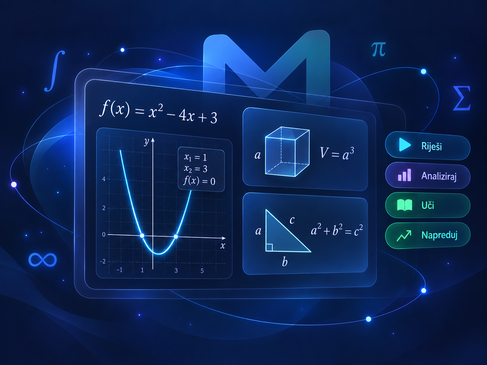
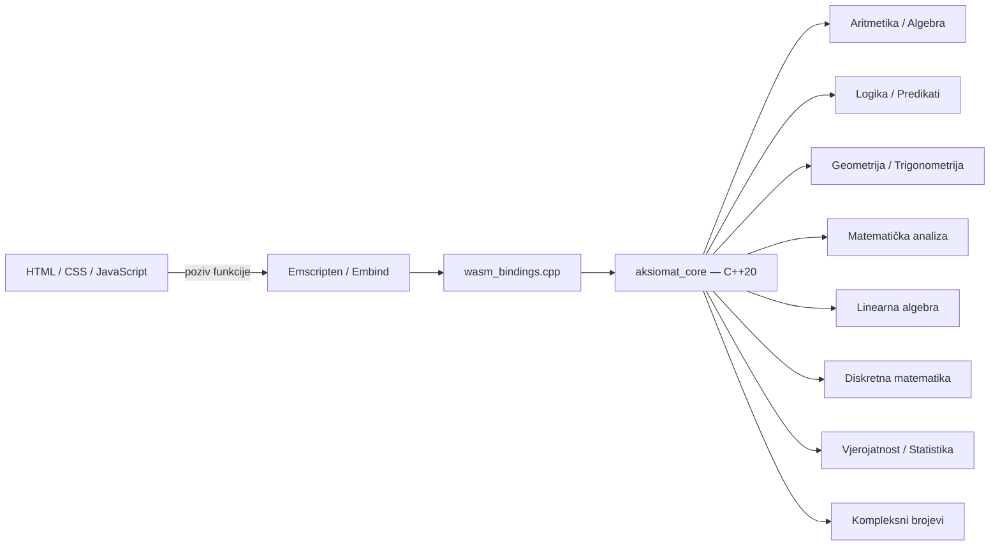

<p align="center">
  
</p>

<h1 align="center">MathEngine</h1>

<p align="center">
  <strong>Matematika koja raste s tobom.</strong>
</p>

<p align="center">
  Edukacijska matematička web-aplikacija pokretana C++20 matematičkom jezgrom i WebAssemblyjem.
  <br>
  Od osnovnih računskih operacija do matematičke analize, linearne algebre, diskretne matematike i statistike.
</p>

<p align="center">
  <a href="https://github.com/StjepanVelc/MathEngine/actions/workflows/ci.yml">
    
  </a>
  
  
  
  <a href="LICENSE.txt">
    
  </a>
</p>

<p align="center">
  
</p>

---

## O projektu

**MathEngine** je samostalni edukacijski projekt nastao s idejom da matematiku učini jasnijom, interaktivnijom i pristupačnijom — od osnovnih računskih operacija do naprednijih matematičkih tema.

U pozadini aplikacije nalazi se matematička jezgra napisana u **C++20**, povezana s web-aplikacijom pomoću **WebAssemblyja** i Emscriptena. Time se preciznost i struktura C++ implementacije koriste izravno u pregledniku, bez potrebe za serverskim backendom.

MathEngine nije zamišljen samo kao kalkulator koji prikazuje konačni rezultat. Cilj je, gdje god je to matematički smisleno, prikazati **postupak rješavanja, logiku iza rješenja, grafove, SVG vizualizacije i interaktivne zadatke** kako bi korisnik mogao razumjeti ne samo *koji* je rezultat, nego i *zašto* je takav.

### Glavna načela

- **Jedna matematička jezgra** — matematička pravila i algoritmi implementirani su u C++, ne dupliciraju se u JavaScriptu.
- **Postupak, ne samo rezultat** — solveri i alati vraćaju strukturirane rezultate i korake rješavanja.
- **Više razina učenja** — isto matematičko jezgro koristi se za osnovnu školu, srednju školu te naprednu/fakultetsku razinu.
- **Vizualno učenje** — grafovi, geometrijski prikazi, vektori, distribucije i drugi rezultati prikazuju se interaktivno gdje je to korisno.
- **Lokalni napredak** — odabrana razina i napredak u vježbaonicama spremaju se u pregledniku pomoću `localStorage`.
- **Otvoreni razvoj** — projekt je dostupan pod MIT licencom.

---

## Razine učenja

Početna stranica omogućuje odabir jedne od tri obrazovne razine. Odabrana razina određuje dostupne alate, primjere i količinu objašnjenja, dok C++ matematička implementacija ostaje jedinstvena.

| Razina | Glavna područja |
|---|---|
| **Osnovna škola** | Aritmetika, razlomci, postotci, teorija brojeva, brojevni sustavi, osnove algebre i geometrija |
| **Srednja škola** | Algebra, trigonometrija, nizovi i redovi, analitička geometrija, eksponencijalne i logaritamske funkcije, kombinatorika, vjerojatnost i statistika, osnove matematičke analize te iskazna logika |
| **Napredno i fakultet** | Matematička logika, predikatna logika, formalna matematička analiza, linearna algebra i 3D analitička geometrija, diskretna matematika, napredna vjerojatnost i statistika te kompleksni brojevi |

---

# Matematičke domene

## Aritmetika

Aritmetička jezgra sadrži vlastiti parser, AST i evaluator.

Podržano je:

- operatori `+`, `-`, `*`, `/`, `%`, `^`
- unarni plus i minus
- postfiksni faktorijel `!`
- zagrade i znanstveni zapis
- konstante `pi` i `e`
- funkcije `sqrt`, `abs`, `min`, `max`, `mod`, `round`, `floor`, `ceil`
- točni razlomci s automatskim skraćivanjem
- decimalni zapis → točan razlomak
- postotni izračuni
- prosti brojevi, djelitelji i prosta faktorizacija
- NZD i NZV
- pretvorbe brojevnih sustava između baza **2–36**

Potenciranje slijedi standardni matematički prioritet, pa primjerice:

```text
-2^2 = -(2^2) = -4
```

---

## Algebra

Algebra koristi zaseban simbolički parser i AST, neovisno o numeričkom aritmetičkom parseru.

Podržano je:

- simboličko parsiranje izraza
- implicitno množenje, npr. `2x` i `3(x+1)`
- pojednostavljivanje izraza
- linearne jednadžbe
- linearne nejednadžbe
- sustavi dviju linearnih jednadžbi
- polinomske operacije
- evaluacija i derivacija polinoma
- diskriminanta i vrh kvadratne funkcije
- realne nultočke polinoma do drugog stupnja
- analiza funkcija
- prikaz postupka rješavanja

Web sloj dodatno prikazuje interaktivne grafove s pomicanjem, zumiranjem i označavanjem karakterističnih točaka.

---

## Iskazna logika

Podržani su Unicode i ASCII operatori:

| Operacija | Unicode | ASCII |
|---|---:|---:|
| Negacija | `¬` | `!` |
| Konjunkcija | `∧` | `&` |
| Disjunkcija | `∨` | `\|` |
| Implikacija | `→` | `->` |
| Ekvivalencija | `↔` | `<->` |

Primjer:

```text
(p ∧ ¬q) → r
```

ili:

```text
(p & !q) -> r
```

Dostupno je:

- parsiranje i evaluacija formula
- automatska tablica istinitosti
- provjera ekvivalencije
- klasifikacija formule kao tautologije, kontradikcije ili kontingencije
- negacijska normalna forma — NNF
- CNF i DNF
- kanonski CNF i DNF

---

## Predikatna logika

Napredna razina podržava:

- predikate proizvoljne arnosti
- slobodne i vezane varijable
- univerzalni kvantifikator `∀`
- egzistencijalni kvantifikator `∃`
- jednakost i nejednakost
- konačne interpretacije
- provjeru arnosti predikata

Primjeri:

```text
∀x ∃y Manji(x, y)
```

```text
forall x (P(x) -> exists y Q(x, y))
```

Interpretacija se zadaje nad konačnom domenom koju korisnik sam definira.

---

## Formalizacija rečenica

Poseban edukacijski modul omogućuje prevođenje hrvatskih rečenica u formule matematičke logike.

Zadaci imaju:

- više razina težine
- legendu simbola
- provjeru logičke ekvivalencije
- objašnjenje rješenja
- lokalno praćenje napretka

---

## Geometrija

Geometrijska jezgra podijeljena je na više neovisnih modula.

Podržano je:

- pretvaranje mjernih jedinica
- duljina, površina, obujam i kapacitet
- kvadrat, pravokutnik, trokut, paralelogram, trapez i krug
- opseg i površina
- klasifikacija trokuta
- treći kut trokuta
- Pitagorin poučak
- kocka, kvadar, prizma i valjak
- oplošje i obujam
- udaljenost i polovište dviju točaka

Web sučelje koristi interaktivne SVG prikaze koji se osvježavaju prema korisničkom unosu.

---

## Trigonometrija

Podržano je:

- pretvaranje stupnjeva i radijana
- normalizacija kuta
- kvadranti i referentni kut
- jedinična kružnica
- `sin`, `cos` i `tan`
- inverzne trigonometrijske funkcije
- karakteristični kutovi
- pravokutni trokuti
- opći trokuti
- SSS, SAS i ASA/AAS slučajevi
- sinusni i kosinusni poučak
- trigonometrijski identiteti
- rješavanje osnovnih trigonometrijskih jednadžbi na zadanom intervalu

---

## Nizovi i redovi

Domena nizova podržava:

- analizu monotonosti
- aritmetičke nizove i redove
- geometrijske nizove i redove
- parcijalne sume
- beskonačni geometrijski red za `|q| < 1`
- rekurzivne definicije
- generalizirani Fibonaccijev niz
- kamate
- populacijski rast
- ponavljane postotne promjene
- anuitetnu otplatu

---

## Analitička geometrija

Srednjoškolski modul analitičke geometrije podržava:

- točke i vektore u ravnini
- skalarni produkt i kut između vektora
- pravce u općem obliku
- vertikalne pravce
- presjek dvaju pravaca
- udaljenost točke od pravca
- kružnicu
- parabolu
- elipsu
- hiperbolu
- fokuse, direktrise i ekscentricitet
- podatke za grafički prikaz

---

## Eksponencijalne i logaritamske funkcije

Podržano je:

- potenciranje i korjenovanje
- racionalne potencije
- eksponencijalne funkcije
- rast i pad
- poluživot i vrijeme udvostručenja
- logaritmi s proizvoljnom bazom
- prirodni, dekadski i binarni logaritam
- promjena baze
- eksponencijalne i logaritamske jednadžbe
- grafovi
- radioaktivni raspad
- pH
- Richterova magnituda
- decibeli

---

## Kombinatorika, vjerojatnost i statistika

Srednjoškolska domena podržava:

### Kombinatoriku

- faktorijel
- permutacije
- permutacije s ponavljanjem
- kombinacije
- kombinacije s ponavljanjem

### Vjerojatnost

- klasičnu vjerojatnost
- komplement događaja
- uniju događaja
- uvjetnu vjerojatnost
- nezavisne događaje

### Deskriptivnu statistiku

- aritmetičku sredinu
- medijan
- mod
- varijancu
- standardnu devijaciju
- raspon
- kvartile
- interkvartilni raspon
- podatke za histogram i stupčaste prikaze

---

## Matematička analiza — srednjoškolske osnove

Modul `calculus_basics` obuhvaća:

- intuitivni limes polinoma
- numeričko približavanje limesu s obje strane
- derivaciju
- jednadžbu tangente
- prosječnu i trenutnu brzinu promjene
- monotonost
- lokalne ekstreme
- određeni integral polinoma
- neovisnu numeričku provjeru integrala Simpsonovom metodom

---

# Napredno i fakultet

## Matematička analiza

Napredna domena `mathematical_analysis` proširuje srednjoškolski modul formalnijim i općenitijim alatima.

Podržano je:

- formalni limes i ε-δ prikaz
- provjera neprekidnosti
- derivacije višeg reda
- lančano pravilo
- nepravi integrali
- integracija supstitucijom
- Taylorovi redovi
- radijus konvergencije reda potencija
- funkcije više varijabli
- parcijalne derivacije
- gradijent
- usmjerena derivacija
- obične diferencijalne jednadžbe
- Eulerova metoda
- Runge-Kutta metoda četvrtog reda — RK4

---

## Analitička geometrija i linearna algebra

Napredna linearno-algebarska jezgra podržava:

- vektore u 3D prostoru
- skalarni i vektorski produkt
- ravninu kroz tri točke
- klasifikaciju centralnih kvadrika
- matrice
- determinante
- inverzne matrice
- linearne transformacije
- svojstvene vrijednosti i svojstvene vektore simetričnih matrica
- linearnu nezavisnost
- rang
- izdvajanje baze vektorskog prostora

---

## Diskretna matematika

Podržano je:

- unija, presjek, razlika i simetrična razlika skupova
- svojstva relacija
- relacije ekvivalencije
- parcijalni uređaji
- analiza grafova
- stupnjevi vrhova
- povezanost
- Eulerovost
- dvodjelnost
- najkraći put BFS algoritmom
- linearne rekurzije drugog reda
- generiranje članova rekurzije
- princip uključivanja i isključivanja
- Dirichletovo načelo
- deranžmani

---

## Vjerojatnost i statistika — napredno

Napredni modul proširuje srednjoškolsku statistiku.

Podržano je:

- binomna razdioba
- Poissonova razdioba
- normalna razdioba
- uniformna razdioba
- očekivanje i varijanca
- gustoća i kumulativna vjerojatnost
- z-vrijednost
- interval pouzdanosti za sredinu
- z-test
- jednostavna linearna regresija
- koeficijent korelacije
- koeficijent determinacije `R²`
- grafički prikaz normalne razdiobe i regresije

---

## Kompleksni brojevi

Podržano je:

- zbrajanje
- oduzimanje
- množenje
- dijeljenje
- kompleksno konjugiranje
- modul i argument
- algebarski oblik
- trigonometrijski oblik
- eksponencijalni oblik
- pretvorbe između prikaza
- De Moivreova formula
- potenciranje kompleksnih brojeva
- svi n-ti korijeni
- kvadratne jednadžbe s kompleksnim rješenjima
- prikaz kompleksnih brojeva u kompleksnoj ravnini

---

# Arhitektura

MathEngine koristi jednu centralnu C++ matematičku jezgru i više prezentacijskih slojeva.



Glavno arhitekturno pravilo projekta je:

> **Obrazovna razina pripada prezentacijskom sloju, a ne matematičkoj jezgri.**

C++ solver ne zna koristi li ga učenik osnovne škole, srednje škole ili student. Frontend odlučuje koje će alate, primjere i objašnjenja prikazati.

## WebAssembly granica

`core/src/wasm_bindings.cpp` predstavlja vezu između C++ jezgre i JavaScripta.

Njegova odgovornost je:

1. primiti vrijednosti pogodne za JavaScript
2. pozvati postojeći C++ API
3. složene rezultate pretvoriti u JSON
4. uhvatiti C++ iznimke
5. vratiti grešku s prefiksom `GRESKA:`

Matematički algoritmi se ne implementiraju ponovno u WASM adapteru ili JavaScriptu.

---

# Struktura projekta

```text
MathEngine/
├── app/
│   └── native CLI demonstracija
│
├── core/
│   ├── include/aksiomat/
│   │   └── javni C++ API po matematičkim domenama
│   ├── src/
│   │   ├── implementacije matematičkih domena
│   │   └── wasm_bindings.cpp
│   └── CMakeLists.txt
│
├── docs/
│   └── tehnička dokumentacija
│
├── scripts/
│   ├── validate_web.mjs
│   └── validate_docs.mjs
│
├── tests/
│   └── GoogleTest testovi C++ jezgre
│
├── web/
│   ├── data/
│   │   └── JSON banke zadataka
│   ├── icons/
│   ├── index.html
│   ├── osnovna-skola.html
│   ├── srednja-skola.html
│   ├── fakultet.html
│   ├── about.html
│   ├── app.js
│   ├── level-page.js
│   ├── <domena>.js
│   ├── style.css
│   ├── aksiomat.js
│   └── aksiomat.wasm
│
├── .github/workflows/ci.yml
├── CMakeLists.txt
├── CMakePresets.json
├── LICENSE.txt
└── README.md
```

---

# Web frontend

Frontend je napisan u čistom:

- **HTML-u**
- **CSS-u**
- **JavaScriptu**

Ne koristi frontend framework ni bundler.

`index.html` služi kao početna stranica i odabir razine, dok svaka obrazovna razina ima zasebnu stranicu:

```text
osnovna-skola.html
srednja-skola.html
fakultet.html
```

Zajednički `level-page.js`:

- učitava WebAssembly modul
- prepoznaje trenutačnu obrazovnu razinu
- filtrira dostupna poglavlja
- pokreće samo JavaScript kontrolere koji postoje na toj stranici

Domenski JavaScript sloj služi prvenstveno za:

- rad s DOM-om
- validaciju korisničkog unosa
- pozivanje WASM API-ja
- formatiranje rezultata
- prikaz postupka
- grafove i SVG vizualizacije
- vježbaonice

Matematička odluka ostaje u C++ jezgri.

---

# Zadaci i lokalna pohrana

Pedagoški sadržaj odvojen je od C++ jezgre.

Banke zadataka nalaze se u:

```text
web/data/
```

i koriste JSON format.

Trenutačno postoje banke za više područja, uključujući:

- formalizaciju logike
- geometriju
- trigonometriju
- nizove i redove
- analitičku geometriju
- eksponencijalne i logaritamske funkcije
- kombinatoriku, vjerojatnost i statistiku
- matematičku analizu
- analitičku geometriju i linearnu algebru
- diskretnu matematiku

Napredak se sprema lokalno u pregledniku pomoću `localStorage`.

Projekt trenutačno ne zahtijeva korisnički račun, poslužitelj ni bazu podataka.

---

# Build i pokretanje

## Zahtjevi

Za native C++ build:

- **CMake 3.14+**
- **C++20 compiler**
- **Ninja**
- GoogleTest se automatski dohvaća kroz CMake `FetchContent`

Za Windows presete:

- Visual Studio / MSVC developer okruženje

Za WebAssembly:

- **Emscripten SDK**

Za pomoćne validacijske skripte:

- **Node.js**

Za jednostavno lokalno posluživanje web-aplikacije može se koristiti Python.

---

## Native build — Windows

Pokreni iz Visual Studio Developer PowerShella:

```powershell
cmake --preset x64-debug
cmake --build out/build/x64-debug
ctest --test-dir out/build/x64-debug --output-on-failure
```

Dostupni preseti:

```text
x64-debug
x64-release
x86-debug
x86-release
wasm-release
```

---

## Native build — generički Ninja

Na sustavu s dostupnim C++20 compilerom:

```bash
cmake -S . -B out/build/native -G Ninja -DCMAKE_BUILD_TYPE=Release
cmake --build out/build/native
ctest --test-dir out/build/native --output-on-failure
```

---

## WebAssembly build

Nakon aktiviranja Emscripten SDK okruženja:

```powershell
cmake --preset wasm-release
cmake --build out/build/wasm-release
```

Build generira:

```text
aksiomat.js
aksiomat.wasm
```

i automatski ih kopira u mapu:

```text
web/
```

---

## Pokretanje web-aplikacije

Web-aplikaciju treba posluživati preko HTTP-a.

Primjer s Pythonovim ugrađenim serverom:

```powershell
cd web
python -m http.server 8000
```

Zatim otvori:

```text
http://localhost:8000
```

Pokretanje direktno preko `file://` nije preporučeno jer učitavanje WASM-a i JSON podataka ovisi o ponašanju preglednika.

---

# Testiranje

Matematička jezgra testira se pomoću **GoogleTesta**.

Testovi su organizirani po domenama i nalaze se u:

```text
tests/
```

Pokrivene su, između ostalog:

- aritmetika
- algebra
- iskazna logika
- predikatna logika
- geometrija
- trigonometrija
- nizovi i redovi
- analitička geometrija
- eksponencijalne i logaritamske funkcije
- kombinatorika, vjerojatnost i statistika
- srednjoškolska matematička analiza
- napredna matematička analiza
- linearna algebra
- diskretna matematika
- napredna vjerojatnost i statistika
- kompleksni brojevi

Svi native testovi pokreću se naredbom:

```powershell
ctest --test-dir out/build/x64-debug --output-on-failure
```

---

# Validacija weba i dokumentacije

Repozitorij sadrži dodatne Node.js validatore.

Provjera web datoteka:

```bash
node scripts/validate_web.mjs
```

Provjera dokumentacije i lokalnih poveznica:

```bash
node scripts/validate_docs.mjs
```

---

# Continuous Integration

GitHub Actions workflow nalazi se u:

```text
.github/workflows/ci.yml
```

Pokreće se na svaki:

```text
push
pull_request
```

CI trenutno koristi dva odvojena posla.

### Native C++ tests

Na `ubuntu-latest`:

```text
checkout
CMake configure
build
CTest
```

### WebAssembly build

Na `ubuntu-latest` s Emscriptenom:

```text
checkout
Emscripten SDK
CMake configure
WASM build
provjera aksiomat.js
provjera aksiomat.wasm
```

Na taj način svaka promjena mora barem uspješno proći native C++ build/testiranje i WebAssembly kompilaciju.

---

# Trenutna ograničenja

MathEngine je edukacijski projekt i nije zamišljen kao potpuno opći računalni algebarski sustav.

Trenutačna ograničenja uključuju:

- tablica istinitosti ograničena je na najviše **6 varijabli**
- predikatna logika trenutačno nema funkcijske simbole
- automatsko rješavanje algebarskih jednadžbi fokusirano je prvenstveno na linearne probleme
- automatsko određivanje realnih nultočaka polinoma ograničeno je na podržani stupanj solvera
- dio napredne matematičke analize u web sučelju koristi katalog unaprijed definiranih funkcija umjesto proizvoljnog JavaScript/C++ callbacka
- korisnički napredak sprema se samo lokalno u trenutnom pregledniku
- projekt trenutačno nema korisničke račune ni serversku bazu podataka

---

# Dokumentacija

Detaljnija tehnička dokumentacija nalazi se u [`docs/`](docs/README.md).

| Dokument | Sadržaj |
|---|---|
| [Arhitektura](docs/architecture.md) | Slojevi sustava, tok podataka i dizajnerske odluke |
| [C++ matematičke domene](docs/core-domains.md) | Detalji implementacije matematičke jezgre |
| [WebAssembly API](docs/wasm-api.md) | Embind izvozi, JSON ugovori i WASM granica |
| [Web frontend](docs/web-frontend.md) | Organizacija HTML/CSS/JavaScript sloja |
| [Zadaci i lokalna pohrana](docs/exercises-and-storage.md) | JSON banke, napredak i `localStorage` |
| [Build i pokretanje](docs/build-and-run.md) | Native i WebAssembly build |
| [Testiranje i CI](docs/testing-and-ci.md) | GoogleTest, validacija i GitHub Actions |
| [Proširivanje MathEnginea](docs/extending-mathengine.md) | Dodavanje novih domena i alata |
| [Obrazovni roadmap](docs/roadmap.md) | Razvoj i status matematičkih modula |

---

# Razvojni princip

Prilikom dodavanja nove funkcionalnosti MathEngine nastoji zadržati sljedeći tok:

```text
C++ matematička domena
        ↓
GoogleTest
        ↓
WebAssembly adapter
        ↓
JavaScript kontroler
        ↓
HTML sučelje
        ↓
vizualizacija / vježbaonica
```

Matematička formula implementira se jednom — u jezgri.

Frontend se bavi načinom na koji se rezultat objašnjava i prikazuje korisniku.

---

# Licenca

Projekt je dostupan pod [MIT licencom](LICENSE.txt).

---

<p align="center">
  <strong>MathEngine</strong><br>
  C++20 · WebAssembly · Emscripten · CMake · JavaScript
</p>