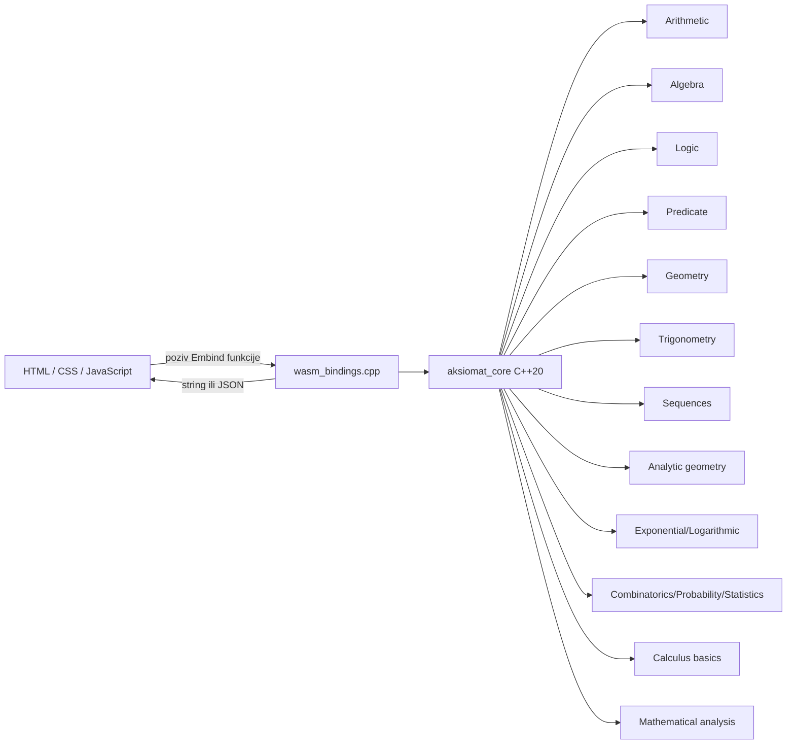
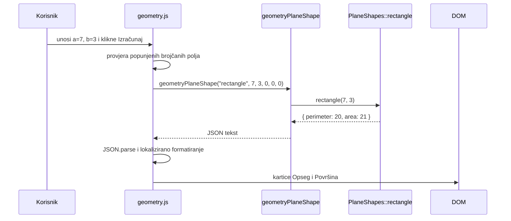
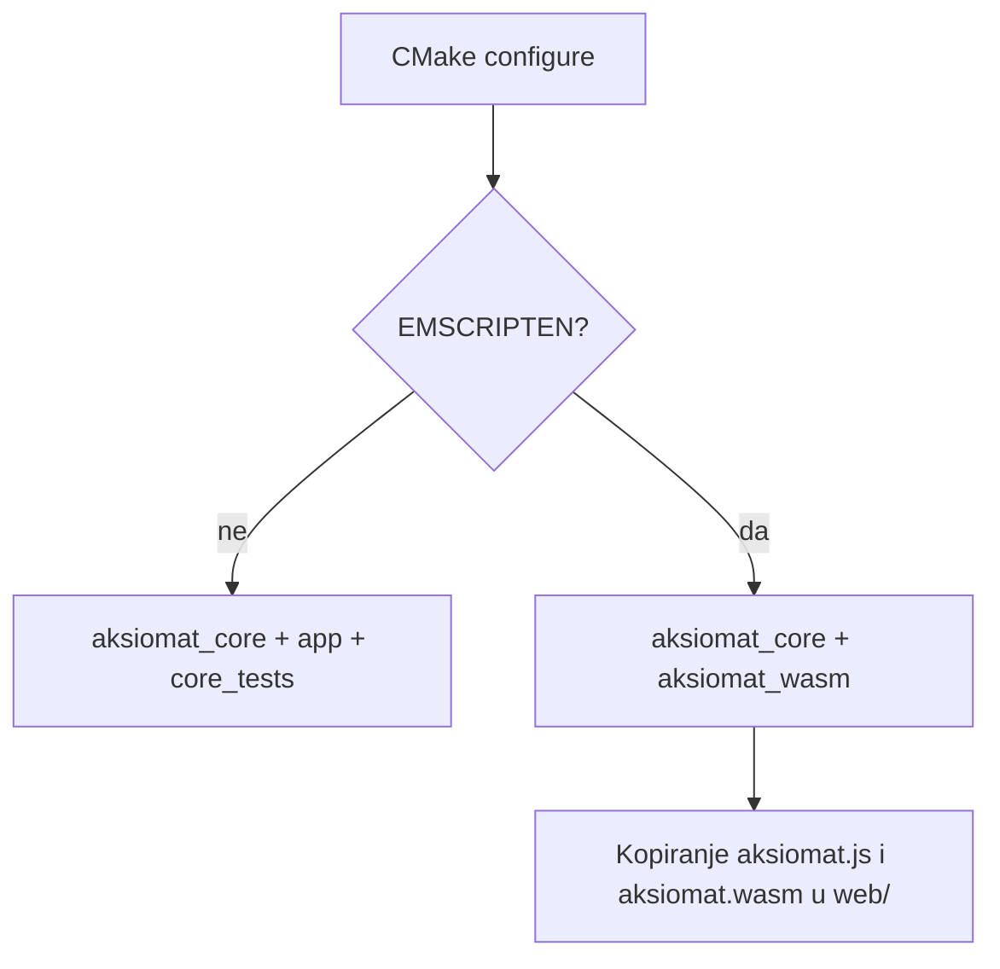

# Arhitektura

## Pregled

MathEngine je edukacijska matematička aplikacija s jednom matematičkom jezgrom i više načina izvođenja. Izračuni, parseri i solveri implementirani su u C++20. Native build povezuje jezgru s malom CLI aplikacijom i GoogleTest testovima, dok Emscripten build istu jezgru izlaže pregledniku kroz WebAssembly.



Glavno arhitekturno pravilo je da obrazovna razina pripada prezentacijskom sloju. C++ solver ne zna koristi li ga osnovnoškolski, srednjoškolski ili napredni prikaz. Frontend bira dostupne panele, primjere i količinu objašnjenja.

## Slojevi

### 1. Matematička jezgra

`aksiomat_core` je statička C++ biblioteka definirana u `core/CMakeLists.txt`.

Odgovornosti:

- parsiranje matematičkog zapisa
- izgradnja AST struktura
- evaluacija i simbolička obrada
- rješavanje jednadžbi i drugih matematičkih problema
- validacija matematičkih preduvjeta
- strukturirani rezultati neovisni o UI-ju

Javni ugovori nalaze se u `core/include/aksiomat/<domena>/`, a implementacije u `core/src/<domena>/`.

### 2. WebAssembly adapter

`core/src/wasm_bindings.cpp` jedina je namjerna granica između C++ jezgre i JavaScripta.

Adapter:

- prima tipove pogodne za JavaScript (`std::string`, `double`, `unsigned`)
- poziva postojeći C++ API
- složene rezultate serializira u JSON tekst
- hvata `std::exception`
- grešku vraća s prefiksom `GRESKA: `
- registrira funkcije kroz `EMSCRIPTEN_BINDINGS`

Adapter ne smije ponovno implementirati matematičku formulu.

### 3. Web frontend

`web/index.html` je samostalna početna (landing) stranica koja sadrži samo naslovnicu i izbor obrazovne razine; 
`web/app.js` upravlja tim izborom i nakon odabira preusmjerava korisnika na posebnu stranicu razine (`osnovna-skola.html`, `srednja-skola.html` ili `fakultet.html`). 
Svaka od tih stranica učitava samo skripte poglavlja koja su joj potrebna te dijeli zajednički bootstrap `web/level-page.js`, koji inicijalizira WASM modul, 
filtrira poglavlja po razini i poziva setup funkcije dostupnih domenskih kontrolera. Svaka veća domena ima vlastiti JavaScript modul.

Frontend je odgovoran za:

- unos i validaciju obaveznih polja
- pozivanje WASM API-ja
- parsiranje JSON rezultata
- formatiranje školskog prikaza
- navigaciju i obrazovne razine
- grafove i SVG vizualizacije
- učitavanje zadataka
- lokalno spremanje napretka

### 4. Podaci

Banke zadataka nalaze se u `web/data/` kao JSON. One nisu ugrađene u WASM jer su pedagoški sadržaj, a ne matematička jezgra.

### 5. Validacija i automatizacija

- `tests/` sadrži GoogleTest testove C++ jezgre.
- `scripts/validate_web.mjs` provjerava JavaScript, JSON, DOM reference i geometrijske zadatke.
- `.github/workflows/ci.yml` pokreće native testove i Emscripten build.

## Tok jednog korisničkog zahtjeva

Primjer: izračun površine pravokutnika.



Ako C++ validacija baci iznimku, adapter vraća `GRESKA: <poruka>`. Frontend takav odgovor ne pokušava parsirati kao JSON, nego ga prikazuje kao grešku.

## Struktura repozitorija

```text
MathEngine/
├── app/                         native CLI demonstracija
├── core/
│   ├── include/aksiomat/       javni C++ ugovori po domenama
│   ├── src/                    implementacije i WASM adapter
│   └── CMakeLists.txt          aksiomat_core i aksiomat_wasm
├── docs/                        tehnička dokumentacija
├── scripts/                     pomoćne validacijske skripte
├── tests/                       GoogleTest testovi
├── web/
│   ├── data/                    JSON banke zadataka
│   ├── index.html              početna (landing) stranica i izbor razine
│   ├── osnovna-skola.html      stranica za osnovnu školu
│   ├── srednja-skola.html      stranica za srednju školu
│   ├── fakultet.html           stranica za napredno i fakultet
│   ├── about.html              odvojena „O nama“ stranica
│   ├── app.js                  bootstrap početne stranice (izbor razine)
│   ├── level-page.js           zajednički bootstrap stranica razina
│   ├── <domena>.js             domenski kontroleri
│   ├── style.css               zajednički dizajn
│   └── aksiomat.{js,wasm}      generirani Emscripten artefakti
├── .github/workflows/ci.yml     kontinuirana integracija
├── CMakeLists.txt               korijenska konfiguracija
└── CMakePresets.json            native i WASM preseti
```

## Native i WASM konfiguracija

Korijenski `CMakeLists.txt` uvijek uključuje `core`. Kada `EMSCRIPTEN` nije aktivan, uključuje i `app` te `tests`. U Emscripten konfiguraciji `core/CMakeLists.txt` dodaje izvršni cilj `aksiomat_wasm`, povezuje ga s `aksiomat_core` i nakon builda kopira generirane datoteke u `web/`.



## Dizajnerske odluke

### Jedna jezgra, više prezentacija

Matematički algoritam postoji jednom. `data-levels` kontrolira vidljivost UI-ja bez grananja unutar C++ domene.

### Domene su odvojene

Aritmetički numerički parser i algebarski simbolički parser nisu isti modul. Time se izbjegava da podrška za varijable i simboličke transformacije zakomplicira osnovnu numeričku evaluaciju.

### Adapteri su tanki

WASM sloj prevodi tipove i greške, ali matematičku odluku prepušta jezgri. To omogućuje testiranje matematike native alatima bez preglednika.

### Pedagoški sadržaj je podatak

Zadaci, tragovi i objašnjenja nalaze se u JSON-u. Njihova izmjena ne zahtijeva rekompilaciju C++ ili WASM koda.

### Generirani artefakti nisu izvor istine

`web/aksiomat.js` i `web/aksiomat.wasm` rezultat su Emscripten builda. Izvor istine čine C++ jezgra, `wasm_bindings.cpp` i CMake konfiguracija.
