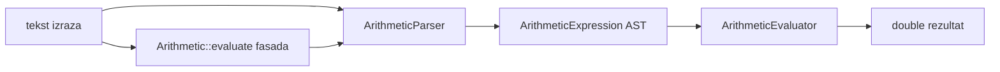

# C++ matematičke domene

## Zajednička organizacija

Svaka aktivna domena slijedi isti osnovni raspored:

- `core/include/aksiomat/<domena>/` — javni API
- `core/src/<domena>/` — implementacija
- `tests/test_<područje>.cpp` — native testovi
- `core/src/wasm_bindings.cpp` — samo adapter za funkcije dostupne webu

Javna zaglavlja ne ovise o DOM-u, JavaScriptu, obrazovnoj razini ni Emscriptenu. Jezgra koristi standardne C++ tipove i iznimke.

## Aritmetika

### Namjena

Aritmetika obrađuje numeričke izraze i osnovne školske brojčane operacije. Namespace je `aksiomat`.

### Izraz, parser i evaluator

`ArithmeticExpression` je nepromjenjivi AST čvor. `ArithmeticOp` razlikuje broj, konstantu, binarne i unarne operacije, faktorijel i funkcijski poziv. Čvorovi se stvaraju tvorničkim metodama `number`, `constant`, `unary`, `binary` i `function`.

Tok evaluacije:

`Arithmetic` je jednostavna kompatibilna fasada za `parse + evaluate`.

Podržani koncepti:

- operatori `+`, `-`, `*`, `/`, `%`, `^`
- unarni plus i minus
- postfiksni faktorijel
- zagrade i znanstveni zapis
- konstante `pi` i `e`
- funkcije `sqrt`, `abs`, `min`, `max`, `mod`, `round`, `floor`, `ceil`

Potenciranje je desno asocijativno i ima prednost pred unarnim minusom, pa je `-2^2` jednako `-(2^2)`.

### Rational

`Rational` čuva brojnik i nazivnik kao 64-bitne cijele brojeve. Razlomak se normalizira pri izgradnji:

- nazivnik je pozitivan
- brojnik i nazivnik skraćeni su NZD-om
- nulti nazivnik nije dopušten
- aritmetičke operacije provjeravaju prekoračenje

API podržava parsiranje razlomka/decimale, četiri računske operacije, mješoviti zapis i decimalnu vrijednost.

### Percentages

`Percentages` sadrži stateless funkcije za:

- `of` — postotak vrijednosti
- `increase` i `decrease` — promjenu vrijednosti
- `ratio` — odnos izražen u postocima
- vraćanje početne vrijednosti prije povećanja ili smanjenja

### NumberTheory

`NumberTheory` radi nad nenegativnim 64-bitnim cijelim brojevima:

- provjera prostosti
- sortirani pozitivni djelitelji
- rastav na proste faktore kao `PrimeFactor { prime, exponent }`
- NZD
- NZV s provjerom overflowa

Nula nema konačan popis djelitelja pa `divisors(0)` baca iznimku. Faktorizacija zahtijeva vrijednost najmanje 2.

### NumeralSystems

`NumeralSystems` pretvara potpisane 64-bitne cijele brojeve između baza 2–36. Za znamenke iznad 9 koristi velika slova `A-Z`. Parser odbija znamenku koja nije valjana u zadanoj bazi i provjerava raspon.

## Algebra

### Zašto je zasebna od aritmetike

Algebra podržava identifikatore, simboličke izraze, implicitno množenje i transformacije. Dijeljenje istog parsera s numeričkim kalkulatorom povećalo bi složenost i promijenilo semantiku postojećeg aritmetičkog API-ja. Zato algebra ima vlastiti AST i parser u namespaceu `aksiomat::algebra`.

### AST, parser i formatter

`AlgebraExpression` modelira:

- brojeve
- varijable
- unarne operacije
- binarne operacije

`AlgebraParser` podržava eksplicitno i implicitno množenje, primjerice `2*x`, `2x` i `3(x+1)`. `AlgebraFormatter` proizvodi normalizirani školski zapis i čuva nužne zagrade.

### Simplifier

`AlgebraSimplifier::simplify` vraća pojednostavljeni izraz i tekstualne korake. Implementacija:

- računa konstantne podizraze
- uklanja neutralne elemente
- normalizira predznake
- spaja kompatibilne članove

Koraci su dio rezultata jer frontend prikazuje postupak, ali sama jezgra ne određuje HTML prezentaciju.

### LinearForm

`LinearForm` je interni most između simboličkog AST-a i linearnih solvera. Izraz pretvara u koeficijente varijabli i konstantu te odbija nelinearne konstrukcije.

### EquationSolver

`EquationSolver::solve` prima tekst jednadžbe i ime varijable. `EquationSolution` sadrži:

- `type`: `Unique`, `Infinite` ili `None`
- brojčanu vrijednost za jedinstveno rješenje
- ime varijable
- korake postupka

Solver podržava linearnu varijablu na obje strane jednakosti.

### InequalitySolver

Rješava linearne relacije `<`, `<=`, `>` i `>=`. Pri dijeljenju negativnim koeficijentom mijenja smjer relacije. Rezultat razlikuje interval, sve realne brojeve i prazan skup te sadrži intervalni zapis i postupak.

### LinearSystemSolver

Rješava dvije linearne jednadžbe s varijablama `x` i `y`. Razlikuje jedinstveno, nijedno i beskonačno mnogo rješenja. Za edukacijski prikaz rezultat uključuje korake Cramerove metode, supstitucije i eliminacije.

### Polynomial

`Polynomial` interno čuva mapu `stupanj → koeficijent` sortiranu silazno. Podržava:

- pretvaranje iz teksta ili algebarskog AST-a
- normalizaciju nultih koeficijenata
- zbrajanje, oduzimanje i množenje
- evaluaciju i derivaciju
- realne nultočke do drugog stupnja
- diskriminantu i vrh kvadratne funkcije
- faktorizirani oblik kada ga je moguće izvesti

### FunctionAnalyzer

Analizira podržanu funkciju na zadanom intervalu i vraća normalizirani izraz, domenu, stupanj, ponašanje, karakteristične točke i uzorke za crtanje. Web graf koristi uzorke, ali Canvas logika nije dio C++ domene.

## Iskazna logika

### LogicExpression

`LogicExpression` je AST za konstante, varijable, negaciju, konjunkciju, disjunkciju, implikaciju i ekvivalenciju. Izraz se evaluira nad `Valuation` mapom `ime → bool` i može vratiti normalizirani tekstualni prikaz.

### LogicParser

Parser prihvaća Unicode i ASCII zapis:

| Operacija | Unicode | ASCII |
|---|---|---|
| negacija | `¬` | `!` |
| konjunkcija | `∧` | `&` |
| disjunkcija | `∨` | `|` |
| implikacija | `→` | `->` |
| ekvivalencija | `↔` | `<->` |

Parser je odgovoran za prioritet i asocijativnost operatora te prijavljuje sintaksne pogreške iznimkom.

### TruthTable

`TruthTable::generate`:

1. prikuplja varijable i sortira ih abecedno
2. generira svih `2^N` valuacija
3. evaluira AST za svaki redak
4. vraća varijable i retke

Broj varijabli ograničen je konstantom `kMaxVariables = 6` radi kontrolirane veličine tablice. `areEquivalent` evaluira dvije formule nad unijom njihovih varijabli.

### LogicAnalysis

Klasificira formulu kao tautologiju, kontradikciju ili kontingenciju na temelju tablice istinitosti.

### NormalForms

Proizvodi:

- negacijsku normalnu formu (NNF)
- transformirani CNF i DNF
- kanonski CNF i DNF

Ekvivalencija transformiranih oblika pokrivena je testovima.

## Predikatna logika

### PredicateExpression

AST podržava:

- predikat s jednim ili više termina
- jednakost i nejednakost
- iskazne veznike
- univerzalni i egzistencijalni kvantifikator

`PredicateLogic.hpp` je umbrella header koji uključuje izraz, parser i interpretaciju.

### PredicateParser

Parser prihvaća zapise poput:

- `Paran(x)`
- `Manji(x, y)`
- `∀x P(x)`
- `exists x (P(x) & Q(x))`
- `x = y` i `x != y`

Prikuplja predikate, slobodne varijable i vezane varijable. Isti predikat u jednoj formuli mora uvijek imati istu arnost.

### Interpretation

`Interpretation` predstavlja konačni model:

- `domain_` — jedinstveni elementi domene
- `facts_` — skup istinitih n-torki po predikatu
- `factArities_` — očekivana arnost predikata

Evaluacija koristi internu mapu dodjele varijabli. Univerzalni kvantifikator provjerava tijelo za svaki element domene, a egzistencijalni traži barem jedan element za koji tijelo vrijedi.

Validacija odbija:

- praznu domenu
- duple elemente domene
- činjenice s elementima izvan domene
- različite arnosti istog predikata
- evaluaciju bez postavljene domene
- slobodnu varijablu bez valjane dodjele

## Geometrija

Namespace je `aksiomat::geometry`. Domena je podijeljena prema vrsti problema, bez UI ili školskih ovisnosti.

### UnitConversion

Enum tipovi definiraju podržane jedinice:

- `LengthUnit`: mm, cm, dm, m, km
- `AreaUnit`: mm², cm², dm², m², ha, km²
- `VolumeUnit`: mm³, cm³, dm³, m³, ml, l

Sve se vrijednosti pretvaraju preko faktora prema SI baznoj jedinici. Vrijednost mora biti konačna i nenegativna, a enum indeks valjan.

### PlaneShapes

`PlaneShapeResult` sadrži `perimeter` i `area`. `PlaneShapes` računa:

- kvadrat
- pravokutnik
- trokut
- paralelogram
- trapez
- krug

Trokut koristi Heronovu formulu i prije računanja provjerava trokutnu nejednakost. Krug koristi `std::numbers::pi`.

### Triangles

`TriangleClassification` razdvaja klasifikaciju po stranicama i kutovima. API podržava:

- jednakostraničan, jednakokračan i raznostraničan trokut
- oštrokutan, pravokutan i tupokutan trokut
- treći kut iz dva poznata
- hipotenuzu iz kateta
- nepoznatu katetu iz hipotenuze i druge katete

Usporedba kvadrata stranica koristi toleranciju za brojeve s pomičnim zarezom.

### Solids

`SolidResult` sadrži `surfaceArea` i `volume`. Podržane su:

- kocka
- kvadar
- uspravna prizma preko površine i opsega baze
- valjak

Sve linearne ili izvedene ulazne mjere moraju biti konačne i pozitivne.

### Coordinates

`Point` ima koordinate `x` i `y`. `Coordinates` računa euklidsku udaljenost i polovište dviju točaka. Koordinate mogu biti negativne, ali moraju biti konačne.

## Pravila grešaka u jezgri

Domene koriste standardne iznimke:

- `std::invalid_argument` za neispravan matematički ili sintaksni ulaz
- `std::overflow_error` kada rezultat ne stane u podržani cjelobrojni raspon
- druge standardne iznimke kada ih proizvede STL operacija

C++ API ne dodaje prefiks `GRESKA:`. Taj format pripada isključivo WASM adapteru.
