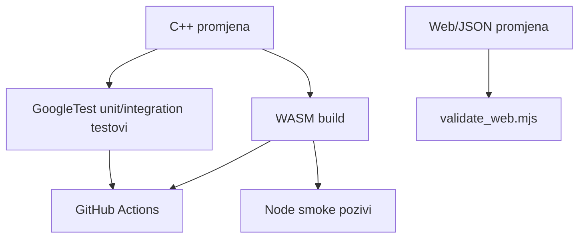

# Testiranje i CI

## Strategija testiranja

MathEngine odvaja testiranje matematičke jezgre od testiranja integracijskih granica.



- GoogleTest provjerava matematičko ponašanje izravno nad C++ API-jem.
- WASM build provjerava da su jezgra i Embind adapter kompatibilni.
- Smoke testovi provjeravaju da JavaScript stvarno može pozvati izvoze i parsirati povrat.
- Web validator provjerava statičke i dinamičke frontend ugovore bez preglednika.

## GoogleTest organizacija

`tests/CMakeLists.txt`:

1. preuzima GoogleTest 1.15.2 kroz `FetchContent`
2. stvara izvršni cilj `core_tests`
3. povezuje ga s `aksiomat_core` i `GTest::gtest_main`
4. koristi `gtest_discover_tests`

Testne datoteke organizirane su po domenama.

### Logika i predikati

- `test_logic_expression.cpp`
- `test_logic_parser.cpp`
- `test_truth_table.cpp`
- `test_logic_analysis.cpp`
- `test_normal_forms.cpp`
- `test_predicate_logic.cpp`

Pokrivaju AST semantiku, sintaksu, prioritete operatora, tablice, ekvivalenciju, normalne forme, kvantifikatore, arnost, domenu i interpretaciju.

### Aritmetika

- `test_arithmetic.cpp`
- `test_rational.cpp`
- `test_percentages.cpp`
- `test_number_theory.cpp`
- `test_numeral_systems.cpp`

Pokrivaju prioritete, funkcije, rubne domene, overflow, skraćivanje razlomaka, postotne operacije, teoriju brojeva i baze.

### Algebra

- `test_algebra_parser.cpp`
- `test_algebra_simplifier.cpp`
- `test_equation_solver.cpp`
- `test_inequality_solver.cpp`
- `test_linear_system_solver.cpp`
- `test_polynomial.cpp`
- `test_function_analyzer.cpp`

Pokrivaju parser/formatter, transformacije, klasifikaciju rješenja, metode sustava, polinomske operacije i uzorkovanje funkcija.

### Geometrija

- `test_geometry_unit_conversion.cpp`
- `test_geometry_plane_shapes.cpp`
- `test_geometry_triangles.cpp`
- `test_geometry_solids_coordinates.cpp`

Pokrivaju sve podržane izračune i neispravne mjere, nemoguće trokute, nevaljane enum vrijednosti i nekonačne koordinate.

### Trigonometrija

Testovi pokrivaju kutove i kružnicu, funkcije i točne zapise, pravokutne/opće trokute, identitete te jednadžbe na intervalu.

### Nizovi i redovi

- `test_sequences_analysis_arithmetic.cpp`
- `test_sequences_geometric.cpp`
- `test_sequences_recurrences_applications.cpp`

Testovi pokrivaju svih šest klasifikacija monotonosti, članove/sume/indekse, posebne kvocijente i divergenciju, rekurzije/Fibonacci te kamate, rast i amortizaciju.

### Analitička geometrija

- `test_analytic_geometry_points_lines.cpp`
- `test_analytic_geometry_circles_conics.cpp`

Pokriveni su vektori, vertikalni i opći pravci, odnosi/presjeci, udaljenosti, tri konstrukcije kružnice, položaj točke te standardne parabole, elipse i hiperbole.

### Eksponencijalne i logaritamske funkcije

- `test_exponential_logarithmic_powers_roots.cpp`
- `test_exponential_logarithmic_exponential_functions.cpp`
- `test_exponential_logarithmic_logarithms.cpp`
- `test_exponential_logarithmic_equations_applications.cpp`

Pokrivene su potencije i korijeni (uključujući negativne baze i neparne korijene), eksponencijalni rast/pad, logaritmi s proizvoljnom bazom i domenskom validacijom, jednadžbe te primjene (radioaktivni raspad, pH, Richterova magnituda, decibeli). Posljednje potvrđeno stanje je 199/199 uspješnih testova.

## Pokretanje svih native testova

```powershell
cmake --build out/build/x64-debug
ctest --test-dir out/build/x64-debug --output-on-failure
```

`--output-on-failure` prikazuje detalje samo neuspješnih testova i zato je prikladan za lokalni rad i CI.

## Ciljano pokretanje

CTest koristi regex nad imenima otkrivenih testova.

Geometrija:

```powershell
ctest --test-dir out/build/x64-debug -R Geometry --output-on-failure
```

Trokuti:

```powershell
ctest --test-dir out/build/x64-debug -R GeometryTriangles --output-on-failure
```

Jednadžbe:

```powershell
ctest --test-dir out/build/x64-debug -R EquationSolver --output-on-failure
```

U Visual Studiju isti testovi mogu se pokretati kroz Test Explorer.

## Što čini dobar C++ test

Novi API treba najmanje:

- jedan standardni uspješni slučaj
- granične vrijednosti
- neispravan ulaz i očekivanu vrstu iznimke
- klasifikacijske varijante ako rezultat ima više stanja
- numeričku toleranciju kada rezultat nije egzaktan u binarnom zapisu

Za egzaktne vrijednosti koristi se `EXPECT_DOUBLE_EQ`; za aproksimacije `EXPECT_NEAR` s opravdanom tolerancijom.

Test ne smije ovisiti o web formatu ili hrvatskoj DOM oznaci ako testira C++ domenu.

## WASM build validacija

```powershell
cmake --build out/build/wasm-release
```

Ovo provjerava:

- kompajliraju li se aktivne domene Emscripten compilerom
- jesu li uključena sva potrebna zaglavlja
- odgovaraju li potpisi Embind registracijama
- može li linker proizvesti JavaScript loader i WASM modul
- jesu li artefakti kopirani u `web/`

`ninja: no work to do` znači da je postojeći build aktualan i uspješan.

## Node smoke testovi

Build sam po sebi ne potvrđuje semantiku izvoza. Smoke test učitava generirani modul i poziva reprezentativne funkcije:

```javascript
const create = require("./web/aksiomat.js");
const module = await create();
const text = module.geometryPlaneShape("rectangle", 7, 3, 0, 0, 0);
const result = JSON.parse(text);
if (result.area !== 21) throw new Error("Unexpected area");
```

Smoke paket treba provjeriti:

- barem jedan export svake promijenjene domene
- da JSON može proći `JSON.parse`
- poznate brojčane rezultate
- očekivani `GRESKA:` za neispravan ulaz

Smoke test nije zamjena za GoogleTest; on provjerava granicu, ne sve algoritamske grane.

## Web validator

`scripts/validate_web.mjs` provjerava:

- sintaksu svih JavaScript datoteka u `web/`
- JSON sintaksu formalizacijske i geometrijske banke
- duple statičke HTML ID-jeve
- Geometry DOM reference
- elemente stvorene statički i kroz dinamički template vježbaonice
- 22 geometrijska zadatka
- jedinstvenost geometrijskih ID-jeva

Pokretanje:

```powershell
node scripts/validate_web.mjs
```

### Zašto uključuje JavaScript template

Većina `geometry-practice-*` elemenata ne postoji u `index.html`; stvara ih `geometry-practice.js` nakon poziva `setupGeometryPractice`. Validator zato pregledava i kontrolirani dinamički markup. Provjera samo statičkog HTML-a dala bi lažno pozitivne „missing ID“ greške.

## Ručna web provjera

Automatska sintaksna provjera ne može potvrditi izgled i ponašanje preglednika. Nakon veće UI promjene provjeriti:

1. početni odabir sve tri obrazovne razine
2. skrivanje i ponovno otvaranje poglavlja
3. tipkovnički unos i Enter gdje je podržan
4. prikaz C++ validacijskih grešaka
5. desktop i mobilnu širinu
6. Canvas pan/zoom
7. Geometry SVG osvježavanje pri unosu
8. učitavanje i reset zadataka
9. ponovno učitavanje stranice i očuvanje `localStorage` stanja
10. konzolu preglednika bez JavaScript grešaka

## GitHub Actions

`.github/workflows/ci.yml` pokreće se na svaki `push` i `pull_request`.

### Job `native`

Okruženje: `ubuntu-latest`.

Koraci:

```text
checkout
cmake configure (Ninja, Release)
build
ctest --output-on-failure
```

Linux CI je koristan dodatak lokalnom MSVC buildu jer otkriva neprenosive pretpostavke i razlike compilerskih implementacija.

### Job `wasm`

Okruženje: `ubuntu-latest`, Emscripten 4.0.15.

Koraci:

```text
checkout
setup emsdk
emcmake configure
build
provjera web/aksiomat.js i web/aksiomat.wasm
```

Trenutačni CI potvrđuje postojanje artefakata, ali ne pokreće Node smoke test ni `scripts/validate_web.mjs`. To su preporučena buduća CI proširenja.

## Kriterij završene promjene

Promjena je spremna kada su primjenjivi uvjeti zadovoljeni:

- source je registriran u CMakeu
- native build prolazi
- ciljani testovi prolaze
- svi testovi prolaze
- WASM build prolazi za promjene jezgre/bindinga
- WASM smoke pozivi prolaze za nove izvoze
- web validator prolazi za frontend/podatkovne promjene
- ručni UI smoke test je obavljen za vizualne promjene
- dokumentacija je usklađena
