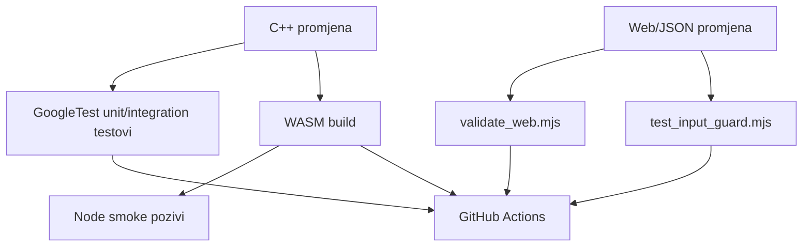

# Testiranje i CI

## Strategija testiranja

MathEngine odvaja testiranje matematičke jezgre od testiranja integracijskih granica.



- GoogleTest provjerava matematičko ponašanje izravno nad C++ API-jem.
- WASM build provjerava da su jezgra i Embind adapter kompatibilni.
- Smoke testovi provjeravaju da JavaScript stvarno može pozvati izvoze i parsirati povrat.
- Web validator provjerava statičke i dinamičke frontend ugovore bez preglednika.

## GoogleTest organizacija

`tests/CMakeLists.txt`:

1. preuzima GoogleTest 1.15.2 kroz `FetchContent`
2. stvara izvršni cilj `core_tests`
3. povezuje ga s `aksiomat_core` i `GTest::gtest_main`
4. koristi `gtest_discover_tests`

Testne datoteke organizirane su po domenama.

### Logika i predikati

- `test_logic_expression.cpp`
- `test_logic_parser.cpp`
- `test_truth_table.cpp`
- `test_logic_analysis.cpp`
- `test_normal_forms.cpp`
- `test_predicate_logic.cpp`

Pokrivaju AST semantiku, sintaksu, prioritete operatora, tablice, ekvivalenciju, normalne forme, kvantifikatore, arnost, domenu i interpretaciju.

### Aritmetika

- `test_arithmetic.cpp`
- `test_rational.cpp`
- `test_percentages.cpp`
- `test_number_theory.cpp`
- `test_numeral_systems.cpp`

Pokrivaju prioritete, funkcije, rubne domene, overflow, skraćivanje razlomaka, postotne operacije, teoriju brojeva i baze.

### Algebra

- `test_algebra_parser.cpp`
- `test_algebra_simplifier.cpp`
- `test_equation_solver.cpp`
- `test_inequality_solver.cpp`
- `test_linear_system_solver.cpp`
- `test_polynomial.cpp`
- `test_function_analyzer.cpp`

Pokrivaju parser/formatter, transformacije, klasifikaciju rješenja, metode sustava, polinomske operacije i uzorkovanje funkcija.

### Geometrija

- `test_geometry_unit_conversion.cpp`
- `test_geometry_plane_shapes.cpp`
- `test_geometry_triangles.cpp`
- `test_geometry_solids_coordinates.cpp`

Pokrivaju sve podržane izračune i neispravne mjere, nemoguće trokute, nevaljane enum vrijednosti i nekonačne koordinate.

### Trigonometrija

Testovi pokrivaju kutove i kružnicu, funkcije i točne zapise, pravokutne/opće trokute, identitete te jednadžbe na intervalu.

### Nizovi i redovi

- `test_sequences_analysis_arithmetic.cpp`
- `test_sequences_geometric.cpp`
- `test_sequences_recurrences_applications.cpp`

Testovi pokrivaju svih šest klasifikacija monotonosti, članove/sume/indekse, posebne kvocijente i divergenciju, rekurzije/Fibonacci te kamate, rast i amortizaciju.

### Analitička geometrija

- `test_analytic_geometry_points_lines.cpp`
- `test_analytic_geometry_circles_conics.cpp`

Pokriveni su vektori, vertikalni i opći pravci, odnosi/presjeci, udaljenosti, tri konstrukcije kružnice, položaj točke te standardne parabole, elipse i hiperbole.

### Eksponencijalne i logaritamske funkcije

- `test_exponential_logarithmic_powers_roots.cpp`
- `test_exponential_logarithmic_exponential_functions.cpp`
- `test_exponential_logarithmic_logarithms.cpp`
- `test_exponential_logarithmic_equations_applications.cpp`

Pokrivene su potencije i korijeni (uključujući negativne baze i neparne korijene), eksponencijalni rast/pad, logaritmi s proizvoljnom bazom i domenskom validacijom, jednadžbe te primjene (radioaktivni raspad, pH, Richterova magnituda, decibeli). Posljednje potvrđeno stanje je 199/199 uspješnih testova.

### Kombinatorika, vjerojatnost i statistika

- `test_combinatorics_probability_statistics_counting.cpp`
- `test_combinatorics_probability_statistics_probability.cpp`
- `test_combinatorics_probability_statistics_descriptive_statistics.cpp`
- `test_combinatorics_probability_statistics_data_visualization.cpp`

Pokrivene su permutacije/kombinacije s ponavljanjem i bez, klasična/uvjetna/nezavisna vjerojatnost, sredina/medijan/mod/varijanca/standardna devijacija/kvartile te izgradnja histogramskih i stupčastih podataka.

### Matematička analiza (srednjoškolske osnove)

- `test_calculus_basics_limits.cpp`
- `test_calculus_basics_derivatives.cpp`
- `test_calculus_basics_derivative_applications.cpp`
- `test_calculus_basics_definite_integral.cpp`

Pokriveni su numerički limes s obje strane, derivacija i tangenta, prosječna/trenutna brzina promjene, monotonost i lokalni ekstremi te određeni integral s neovisnom Simpsonovom provjerom. Posljednje potvrđeno stanje nakon integracije je 229/229 uspješnih testova.

### Matematička analiza (napredno i fakultet)

- `test_mathematical_analysis_formal_limits.cpp`
- `test_mathematical_analysis_advanced_derivatives.cpp`
- `test_mathematical_analysis_advanced_integrals.cpp`
- `test_mathematical_analysis_function_series.cpp`
- `test_mathematical_analysis_multivariable_calculus.cpp`
- `test_mathematical_analysis_differential_equations.cpp`

Pokriveni su epsilon-delta tablica i neprekidnost polinoma, viši red derivacije i lančano pravilo, konvergencija nepravog integrala i integracija supstitucijom, Taylorov red i radijus konvergencije reda potencija, numeričke parcijalne/usmjerene derivacije te Eulerova i Runge-Kutta 4 metoda za obične diferencijalne jednadžbe. Posljednje potvrđeno stanje nakon integracije je 254/254 uspješnih testova.

## Pokretanje svih native testova

```powershell
cmake --build out/build/x64-debug
ctest --test-dir out/build/x64-debug --output-on-failure
```

`--output-on-failure` prikazuje detalje samo neuspješnih testova i zato je prikladan za lokalni rad i CI.

## Ciljano pokretanje

CTest koristi regex nad imenima otkrivenih testova.

Geometrija:

```powershell
ctest --test-dir out/build/x64-debug -R Geometry --output-on-failure
```

Trokuti:

```powershell
ctest --test-dir out/build/x64-debug -R GeometryTriangles --output-on-failure
```

Jednadžbe:

```powershell
ctest --test-dir out/build/x64-debug -R EquationSolver --output-on-failure
```

U Visual Studiju isti testovi mogu se pokretati kroz Test Explorer.

## Što čini dobar C++ test

Novi API treba najmanje:

- jedan standardni uspješni slučaj
- granične vrijednosti
- neispravan ulaz i očekivanu vrstu iznimke
- klasifikacijske varijante ako rezultat ima više stanja
- numeričku toleranciju kada rezultat nije egzaktan u binarnom zapisu

Za egzaktne vrijednosti koristi se `EXPECT_DOUBLE_EQ`; za aproksimacije `EXPECT_NEAR` s opravdanom tolerancijom.

Test ne smije ovisiti o web formatu ili hrvatskoj DOM oznaci ako testira C++ domenu.

## WASM build validacija

```powershell
cmake --build out/build/wasm-release
```

Ovo provjerava:

- kompajliraju li se aktivne domene Emscripten compilerom
- jesu li uključena sva potrebna zaglavlja
- odgovaraju li potpisi Embind registracijama
- može li linker proizvesti JavaScript loader i WASM modul
- jesu li artefakti kopirani u `web/`

`ninja: no work to do` znači da je postojeći build aktualan i uspješan.

## Node smoke testovi

Build sam po sebi ne potvrđuje semantiku izvoza. Smoke test učitava generirani modul i poziva reprezentativne funkcije:

```javascript
const create = require("./web/aksiomat.js");
const module = await create();
const text = module.geometryPlaneShape("rectangle", 7, 3, 0, 0, 0);
const result = JSON.parse(text);
if (result.area !== 21) throw new Error("Unexpected area");
```

Smoke paket treba provjeriti:

- barem jedan export svake promijenjene domene
- da JSON može proći `JSON.parse`
- poznate brojčane rezultate
- očekivani `GRESKA:` za neispravan ulaz

Smoke test nije zamjena za GoogleTest; on provjerava granicu, ne sve algoritamske grane.

## Web validator

`scripts/validate_web.mjs` provjerava:

- sintaksu svih JavaScript datoteka u `web/`
- JSON sintaksu svih banaka zadataka (formalizacija, geometrija, trigonometrija, nizovi, analitička geometrija, eksponencijalne/logaritamske funkcije, kombinatorika/vjerojatnost/statistika, matematička analiza)
- duple statičke HTML ID-jeve (unutar svake od `index.html`, `osnovna-skola.html`, `srednja-skola.html`, `fakultet.html`, `about.html`)
- Geometry DOM reference
- elemente stvorene statički na bilo kojoj HTML stranici i kroz dinamički template vježbaonice
- 22 geometrijska zadatka te po 24 zadatka za trigonometriju, nizove, analitičku geometriju, eksponencijalne/logaritamske funkcije, kombinatoriku/vjerojatnost/statistiku i matematičku analizu
- jedinstvenost ID-jeva u svim bankama
- da `osnovna-skola.html`, `srednja-skola.html` i `fakultet.html` učitavaju `input-guard.js` prije `aksiomat.js` i ostalih modula
- da svaki `type="text"` input na tim stranicama ima atribut `maxlength`

Pokretanje:

```powershell
node scripts/validate_web.mjs
```

## Test zaštite unosa (`input-guard.js`)

`scripts/test_input_guard.mjs` učitava `web/input-guard.js` u Node `vm` kontekst s minimalnim `document`/`window` stubovima (bez pravog preglednika) i provjerava:

- da `guardValue` uklanja `<`/`>` iz tekstualnih i brojčanih polja
- da se tekstualni unos skraćuje na 200 znakova, a brojčani na 32 znaka
- da legitimna matematička/logička notacija (unicode simboli poput ∧, ¬, →, ∀, ∃) ostaje netaknuta
- da se polja koja nisu tekst/broj/search (npr. `range`) i ne-input elementi ignoriraju
- da `formatNumberForDisplay` vraća plošni decimalni zapis za uobičajene brojeve, a znanstveni zapis (`1.235e+8`, `1.234e-7`) za vrlo velike/male vrijednosti
- da `formatNumberForDisplay` ne baca grešku na `NaN`/`Infinity`/ne-brojčane vrijednosti
- da `boundedNumber(id, {min, max, integer})` odbija prazna, ne-konačna, izvan raspona i (kad je traženo) ne-cjelobrojna polja, uključujući kratke ali semantički ogromne unose poput `1e308`

Pokretanje:

```powershell
node scripts/test_input_guard.mjs
```

## Ograničenja složenosti (computational limits)

Duljina unosa (`maxlength`) i `boundedNumber()` sprječavaju očito prevelike ili besmislene unose na razini preglednika, ali WASM funkcije mogu se pozvati i izravno iz konzole preglednika, pa je stvarna granica u C++ core-u:

- `discrete_math::Recurrences::generateTerms` — najviše 500 članova (`maximumRecurrenceTerms`), uz provjeru overflowa tijekom generiranja
- `mathematical_analysis::DifferentialEquations::solveEuler` i `solveRungeKutta4` — procijenjeni broj koraka `ceil((finalT - initialT) / stepSize)` ne smije prijeći 5000 (`maximumOdeSteps`)
- `mathematical_analysis::AdvancedDerivatives::nthDerivative` — red derivacije ograničen na 1-50 (`maximumDerivativeOrder`)
- `analytic_geometry::PointsVectors` (2D) i `linear_algebra::SpaceVectorsPlanes` (3D) — koordinate i skalari ograničeni na raspon [-1e6, 1e6] (`maximumMagnitude`) u zajedničkoj `requireFinite` provjeri
- `wasm_bindings.cpp::formatDouble` — baca `std::overflow_error` ako je konačan unos svejedno proizveo `NaN`/`Infinity` rezultat (npr. zbog međurezultata koji je preplavio raspon), pa se to nikad ne vraća kao JSON

Ova ograničenja pokrivena su odgovarajućim GoogleTest testovima u `tests/` (npr. `Recurrences.ThrowsWhenCountExceedsMaximum`, `DifferentialEquations.RejectsExcessiveStepCount`, `AdvancedDerivatives.RejectsOrderAboveMaximum`, `AnalyticGeometryVectors.RejectsCoordinatesAboveMagnitudeLimit`, `SpaceVectorsPlanes.RejectsCoordinatesAboveMagnitudeLimit`) koji se pokreću u sklopu redovnog `native` CI posla.

### Zašto uključuje JavaScript template

Većina `geometry-practice-*` elemenata ne postoji ni u jednoj HTML stranici; stvara ih `geometry-practice.js` nakon poziva `setupGeometryPractice`. Validator zato pregledava i kontrolirani dinamički markup uz sve statičke stranice (`index.html`, `osnovna-skola.html`, `srednja-skola.html`, `fakultet.html`, `about.html`). Provjera samo jedne statičke stranice dala bi lažno pozitivne „missing ID“ greške jer su poglavlja sada raspoređena po različitim stranicama razina.

## Ručna web provjera

Automatska sintaksna provjera ne može potvrditi izgled i ponašanje preglednika. Nakon veće UI promjene provjeriti:

1. početni odabir sve tri obrazovne razine
2. skrivanje i ponovno otvaranje poglavlja
3. tipkovnički unos i Enter gdje je podržan
4. prikaz C++ validacijskih grešaka
5. desktop i mobilnu širinu
6. Canvas pan/zoom
7. Geometry SVG osvježavanje pri unosu
8. učitavanje i reset zadataka
9. ponovno učitavanje stranice i očuvanje `localStorage` stanja
10. konzolu preglednika bez JavaScript grešaka

## GitHub Actions

`.github/workflows/ci.yml` pokreće se na svaki `push` i `pull_request`.

### Job `native`

Okruženje: `ubuntu-latest`.

Koraci:

```text
checkout
cmake configure (Ninja, Release)
build
ctest --output-on-failure
```

Linux CI je koristan dodatak lokalnom MSVC buildu jer otkriva neprenosive pretpostavke i razlike compilerskih implementacija.

### Job `web`

Okruženje: `ubuntu-latest`, Node.js 22.

Koraci:

```text
checkout
setup Node.js
node scripts/validate_web.mjs
node scripts/test_input_guard.mjs
```

Ovaj job pokreće web validator i test zaštite unosa opisane gore, na svaki `push`/`pull_request`.

### Job `wasm`

Okruženje: `ubuntu-latest`, Emscripten 4.0.15.

Koraci:

```text
checkout
setup emsdk
emcmake configure
build
provjera web/aksiomat.js i web/aksiomat.wasm
```

Trenutačni CI ne pokreće Node WASM smoke test (poziv generiranog modula); to je preporučeno buduće CI proširenje.

### Job `deploy`

Pokreće se samo na `push` prema grani `master` (ne na `pull_request`), nakon uspješnog `native`, `web` i `wasm` job-a (`needs: [native, web, wasm]`) —
dakle tek kad prođu i C++ testovi, web validacija/testovi te WASM build. Preuzima artefakt otpremljen u `wasm` jobu (`actions/upload-pages-artifact` nad mapom `web/`,
koja u tom trenutku već sadrži svježe izgrađene `aksiomat.js`/`aksiomat.wasm`) i objavljuje ga na GitHub Pages preko `actions/deploy-pages`.

### Analitika (Cloudflare Web Analytics)

Sve stranice u `web/` (`index.html`, `about.html`, `fakultet.html`, `osnovna-skola.html`, `srednja-skola.html`) sadrže Cloudflare Web Analytics beacon skriptu u `<head>`. 
Ovo je cookie-free, privacy-friendly analitika (bez cookie bannera, bez praćenja korisnika preko kolačića) koja daje osnovni uvid u broj posjeta i posjećene stranice. 
Token se upravlja preko Cloudflare dashboarda (Analytics → Web Analytics) i nije potrebno mijenjati DNS niti hosting.

## Kriterij završene promjene

Promjena je spremna kada su primjenjivi uvjeti zadovoljeni:

- source je registriran u CMakeu
- native build prolazi
- ciljani testovi prolaze
- svi testovi prolaze
- WASM build prolazi za promjene jezgre/bindinga
- WASM smoke pozivi prolaze za nove izvoze
- web validator prolazi za frontend/podatkovne promjene
- ručni UI smoke test je obavljen za vizualne promjene
- dokumentacija je usklađena
