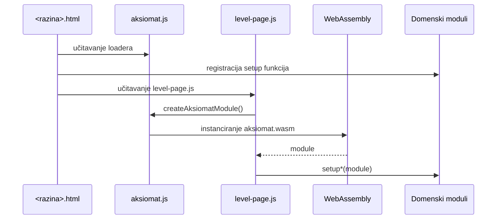

# Web frontend

## Pregled

Frontend je statička HTML/CSS/JavaScript aplikacija u mapi `web/`. Ne koristi framework ni bundler.

Aplikacija je podijeljena na početnu (landing) stranicu i tri odvojene stranice po obrazovnoj razini:

- `web/index.html` — samo naslovnica i izbor obrazovne razine; ne sadrži nijedno poglavlje niti WASM inicijalizaciju.
- `web/osnovna-skola.html`, `web/srednja-skola.html`, `web/fakultet.html` — zasebne statičke stranice, svaka učitava samo skripte poglavlja relevantnih za tu razinu.
- `web/about.html` — odvojena „O nama“ stranica.

Svaka od stranica poglavlja dijeli globalni Emscripten modul preko zajedničkog bootstrapa `web/level-page.js`, a svaki domenski modul inicijalizira samo svoju domenu.

## Učitavanje početne stranice (`index.html`)

`index.html` učitava samo `style.css` i `app.js`. Ne učitava Emscripten loader niti ijedan domenski modul jer ne prikazuje nijedno poglavlje — samo izbor razine koji nakon klika preusmjerava na odgovarajuću stranicu (vidi [`web/app.js`](#webappjs)).

## Učitavanje stranica razina (`osnovna-skola.html`, `srednja-skola.html`, `fakultet.html`)

Svaka stranica razine učitava vlastiti podskup domenskih skripti (samo poglavlja relevantna za tu razinu) te uvijek završava sa `level-page.js`, koji je zajednički bootstrap. Primjer relevantnog redoslijeda (puni skup, kao na `fakultet.html`):

1. `aksiomat.js` — generirani Emscripten loader
2. `formalization.js`
3. `predicates.js`
4. `arithmetic.js`
5. `geometry-visuals.js`, `geometry-practice.js`, `geometry.js`
6. `trigonometry-visuals.js`, `trigonometry-practice.js`, `trigonometry.js`
7. `sequences-visuals.js`, `sequences-practice.js`, `sequences.js`
8. `analytic-geometry-visuals.js`, `analytic-geometry-practice.js`, `analytic-geometry.js`
9. `exponential-logarithmic-visuals.js`, `exponential-logarithmic-practice.js`, `exponential-logarithmic.js`
10. `combinatorics-probability-statistics-visuals.js`, `combinatorics-probability-statistics-practice.js`, `combinatorics-probability-statistics.js`
11. `calculus-basics-visuals.js`, `calculus-basics-practice.js`, `calculus-basics.js`
12. `mathematical-analysis-visuals.js`, `mathematical-analysis-practice.js`, `mathematical-analysis.js`
13. `graph.js`
14. `algebra.js`
15. `analytic-algebra.js`, `analytic-algebra-practice.js`
16. `discrete-math-visuals.js`, `discrete-math-practice.js`, `discrete-math.js`
17. `probability-statistics-visuals.js`, `probability-statistics.js`
18. `complex-numbers-visuals.js`, `complex-numbers.js`
19. `level-page.js`

Osnovna i srednja škola u svojoj HTML datoteci učitavaju samo skripte poglavlja koja su na toj razini dostupna (npr. `osnovna-skola.html` učitava samo `arithmetic.js`, geometrijske i `algebra.js` module).

Domenski moduli definiraju globalne setup funkcije prije nego što `level-page.js` pozove `initLevelPage()`.



Ako `createAksiomatModule` nije dostupan, statusni element prikazuje uputu za WASM build i ostatak stranice se ne inicijalizira.

## `web/index.html`

Početna (landing) stranica definira samo:

- zaglavlje aplikacije s navigacijom (Početna / O nama)
- hero sekciju
- odabir obrazovne razine (`#learning-levels`, kartice razina)

Ne sadrži poglavlja, obrasce, statusni element WASM-a niti ijedan Canvas/SVG spremnik — svi ti elementi premješteni su u stranice pojedinih razina.

## `web/osnovna-skola.html`, `web/srednja-skola.html`, `web/fakultet.html`

Svaka od ovih stranica definira:

- zaglavlje s oznakom trenutačne razine i poveznicom natrag na `index.html` („Izbor škole“)
- status učitavanja WASM modula
- poglavlja i pod-panele relevantne za tu razinu
- obrasce i rezultate
- Canvas element algebarskog grafa (gdje je algebra dostupna)
- spremnike za geometrijske SVG crteže
- jedan korijenski spremnik za dinamičku geometrijsku vježbaonicu (gdje je geometrija dostupna)

### Konvencija poglavlja

Poglavlje koristi:

```html
<section class="chapter" data-levels="primary secondary" hidden>
	<button class="chapter-toggle" aria-expanded="false">...</button>
	<div class="chapter-body" hidden>...</div>
</section>
```

`data-levels` je popis razina odvojenih razmakom. Element bez tog atributa smatra se dostupnim na svim razinama.

### Konvencija panela

Svaka domena ima vlastitu klasu gumba i panela:

- `.subchapter-toggle` / `.subchapter-panel`
- `.arithmetic-toggle` / `.arithmetic-panel`
- `.algebra-toggle` / `.algebra-panel`
- `.geometry-toggle` / `.geometry-panel`
- `.trigonometry-toggle` / `.trigonometry-panel`
- `.sequences-toggle` / `.sequences-panel`
- `.analytic-geometry-toggle` / `.analytic-geometry-panel`
- `.exponential-logarithmic-toggle` / `.exponential-logarithmic-panel`
- `.cps-toggle` / `.cps-panel`
- `.calculus-basics-toggle` / `.calculus-basics-panel`
- `.mathematical-analysis-toggle` / `.mathematical-analysis-panel`

Gumb preko `data-panel` pokazuje na `id` pripadajućeg panela.

## `web/app.js`

`app.js` upravlja isključivo izborom razine na početnoj stranici (`index.html`). Ne inicijalizira WASM niti bilo koji domenski modul.

### Obrazovne razine

`learningLevels` mapira interne identifikatore na oznaku i ciljnu stranicu:

- `primary` → { label: „Osnovna škola“, page: `osnovna-skola.html` }
- `secondary` → { label: „Srednja škola“, page: `srednja-skola.html` }
- `advanced` → { label: „Napredno i fakultet“, page: `fakultet.html` }

`setupLearningLevels()`:

- čita spremljenu razinu iz `localStorage` (ključ `mathengine-learning-level`) i prikazuje je kao trenutačno aktivnu karticu
- omogućuje otvaranje/zatvaranje mreže kartica razina (`openLevelGrid()` / `closeLevelGrid()`)
- pri klikom odabranoj karticu (`selectLevel(level)`) sprema izbor u `localStorage` i preusmjerava (`window.location.href`) na pripadajuću stranicu
- poveznica „Početna“ u zaglavlju poziva `resetLevelSelection()`, koja briše spremljeni izbor i ponovno prikazuje odabir razina bez preusmjeravanja

Važno: filtriranje po razini ne mijenja C++ API niti stvara zasebne matematičke implementacije — samo bira koja statička stranica i koji podskup skripti se učitava.

## `web/level-page.js`

`level-page.js` je zajednički bootstrap koji se učitava na dnu svake stranice razine (`osnovna-skola.html`, `srednja-skola.html`, `fakultet.html`).

`supportsLevel(element, level)` provjerava `data-levels`.

`applyLevelFilter(level)`:

- skriva poglavlja (`.chapter`) koja ne podržavaju trenutačnu razinu
- skriva gumbe i panele svih domenskih klasa (`.subchapter-toggle`, `.arithmetic-toggle`, `.algebra-toggle`, `.geometry-toggle`, `.trigonometry-toggle`, `.sequences-toggle`, `.analytic-geometry-toggle`, `.exponential-logarithmic-toggle`, `.calculus-basics-toggle`, `.mathematical-analysis-toggle`, `.analytic-algebra-toggle`, `.discrete-math-toggle`, `.probability-statistics-toggle`, `.complex-numbers-toggle`) koje ne podržavaju razinu i uklanja im klasu `active`

### Poglavlja i podpoglavlja

`setupChapters()` kontrolira otvaranje tijela poglavlja i ažurira `aria-expanded` te znak `▸/▾`.

`setupSubchapters()` osigurava da je unutar logike otvoren najviše jedan panel.

### Bootstrap stranice razine

`initLevelPage()`:

1. čita `document.body.dataset.learningLevel` (postavljeno preko `data-learning-level` atributa na `<body>` svake stranice razine)
2. primjenjuje `applyLevelFilter`, `setupChapters`, `setupSubchapters`
3. provjerava Emscripten loader; ako nedostaje, statusni element prikazuje uputu za WASM build
4. čeka `createAksiomatModule()`
5. poziva `callIfDefined(name, module)` za setup funkciju svake domene koja može biti učitana na toj stranici (logika, predikati, formalizacija, aritmetika, geometrija, trigonometrija, nizovi, analitička geometrija, eksponencijalne/logaritamske funkcije, kombinatorika/vjerojatnost/statistika, matematička analiza, algebra, analitička algebra, diskretna matematika, vjerojatnost i statistika, kompleksni brojevi) — funkcije koje nisu učitane na toj stranici jednostavno se preskaču

Aritmetika, algebra i geometrija imaju istu logiku u vlastitim setup funkcijama jer upravljaju domenski specifičnim klasama.

## Frontend nizova i redova

`sequences.js` upravlja sa šest srednjoškolskih panela, formatira WASM JSON, gradi tablice članova i obrazovne korake. `sequences-visuals.js` crta diskretne SVG točke, parcijalne sume, granicu konvergentnog reda, rekurzivne veze i razvoj vrijednosti kroz vrijeme. `sequences-practice.js` dinamički stvara vježbaonicu i učitava 24 zadatka iz `web/data/sequences-exercises.json`.

## Frontend analitičke geometrije

`analytic-geometry.js` upravlja panelima vektora, pravaca, kružnice, konika i vježbaonice. Dinamički prilagođava polja načinu zadavanja kružnice i vrsti konike. `analytic-geometry-visuals.js` koristi jednako skaliranje x/y osi kako ne bi izobličio kružnice i konike te prikazuje vektore, presjeke, okomite projekcije, fokuse i direktrisu. Vježbaonica učitava `web/data/analytic-geometry-exercises.json`.

## Frontend eksponencijalnih i logaritamskih funkcija

`exponential-logarithmic.js` upravlja panelima potencija/korijena, eksponencijalne funkcije, logaritamske funkcije, jednadžbi, primjena i vježbaonice. Dinamički prilagođava polja načinu računanja (potencija/korijen) i vrsti primjene. `exponential-logarithmic-visuals.js` crta graf eksponencijalne funkcije s horizontalnom asimptotom te graf logaritamske funkcije s vertikalnom asimptotom. Vježbaonica učitava `web/data/exponential-logarithmic-exercises.json`.

## Frontend kombinatorike, vjerojatnosti i statistike

`combinatorics-probability-statistics.js` upravlja panelima prebrojavanja, vjerojatnosti, deskriptivne statistike i vizualizacije podataka te vježbaonice. Odabir `mode` selecta prilagođava vidljiva polja (npr. broj `n`/`k` za prebrojavanje, tri parametra za vjerojatnost). Rezultati statistike i vizualizacije prikazuju se kao histogram/stupčasti dijagram preko SVG-a generiranog izravno u kontroleru. `combinatorics-probability-statistics-practice.js` učitava `web/data/combinatorics-probability-statistics-exercises.json`.

## Frontend matematičke analize (srednjoškolske osnove)

`calculus-basics.js` upravlja s pet panela: limes, derivacija (uključujući prosječnu/trenutnu brzinu promjene), primjene derivacije (monotonost i ekstremi), određeni integral te vježbaonica. `calculus-basics-visuals.js` crta SVG vizualizaciju približavanja limesu (`CalculusBasicsVisuals.limitApproach`). `calculus-basics-practice.js` uvačava `web/data/calculus-basics-exercises.json` i sprema napredak pod ključem `mathengine-calculus-basics-practice-v1`.

## Frontend matematičke analize (napredno i fakultet)

`mathematical-analysis.js` upravlja sa šest panela za formalnu i naprednu analizu (formalni limes/kontinuitet, napredne derivacije, napredni integrali, redovi funkcija, funkcije više varijabli, diferencijalne jednadžbe) te vježbaonicom. Panel odabire funkciju iz padajućeg izbornika (`<select>`) umjesto slobodnog unosa izraza kad WASM adapter očekuje naziv iz kataloga (nepravi integrali, Taylorov red, funkcije više varijabli, diferencijalne jednadžbe), jer jezgra nema opći parser izraza s više varijabli. `mathematical-analysis-visuals.js` crta SVG usporedbu Taylorove aproksimacije sa stvarnom funkcijom (`MathematicalAnalysisVisuals.taylorApproximation`) i putanje Eulerove/RK4 metode (`MathematicalAnalysisVisuals.odeTrajectory`). `mathematical-analysis-practice.js` učitava `web/data/mathematical-analysis-exercises.json` i sprema napredak pod ključem `mathengine-mathematical-analysis-practice-v1`. Poglavlje je vidljivo samo na obrazovnoj razini `advanced` (`data-levels="advanced"`).

### Palete simbola

`setupPalette(palette, onInsert)` umeće simbol na trenutačnu poziciju kursora u ciljani input. Cilj se određuje atributom `data-target`. Nakon umetanja opcionalno poziva callback za ponovnu evaluaciju.

## `web/arithmetic.js`

`setupArithmetic(module)` upravlja s pet panela.

### Zajednički helperi

- `requireValues` provjerava obavezna polja
- `renderRows` gradi standardne kartice rezultata
- `renderError` prikazuje grešku bez pokušaja parsiranja JSON-a

### Paneli

- Kalkulator: poziva `evaluateArithmetic` pri kliku ili Enteru.
- Razlomci: poziva `rationalCalculate` i `rationalFromDecimal`.
- Postotci: operacija iz selecta izravno odgovara WASM identifikatoru.
- Teorija brojeva: prikazuje prostost, djelitelje, faktorizaciju, NZD i NZV.
- Brojevni sustavi: šalje tekst broja i dvije baze.

## `web/algebra.js`

`setupAlgebra(module)` upravlja izrazima, jednadžbama, nejednadžbama, sustavima, polinomima i funkcijama.

Odgovornosti:

- pretvaranje API JSON-a u edukativne kartice
- školski zapis operatora i predznaka
- prikaz koraka
- prikaz tri metode sustava
- crtanje brojevne crte za nejednadžbe
- predaja analize funkcije modulu `graph.js`

Algebarski frontend ne rješava jednadžbu samostalno.

## `web/graph.js`

`setupAlgebraGraph(module)` upravlja Canvas grafom.

Funkcionalnosti:

- responzivna veličina platna
- mreža i osi
- pan povlačenjem
- zoom kotačićem
- prikaz koordinata kursora
- animirani prijelaz između funkcija
- karakteristične točke: nultočke, sjecište s y-osi i vrh
- klizači parametara `a`, `b`, `c`
- `prefers-reduced-motion` podrška

Matematičke točke i uzorke dobiva iz `algebraAnalyzeFunction`.

## `web/predicates.js`

`setupPredicates(module)`:

1. parsira formulu i čita opis predikata
2. prima konačnu domenu
3. generira moguće n-torke prema arnosti predikata
4. dopušta korisniku označavanje istinitih činjenica
5. serializira domenu i činjenice za `predicateEvaluate`

Radi zaštite preglednika broj prikazanih n-torki ograničen je na 256.

## `web/formalization.js`

Formalizacijski modul učitava `web/data/formalization-exercises.json`, prikazuje rečenicu i legendu, a korisničku formulu provjerava funkcijom `logicEquivalent`.

Modul vodi statistiku po težini, omogućuje reset trenutačne ili ukupne statistike i sprema stanje lokalno.

## `web/geometry.js`

`setupGeometry(module)` je kontroler svih geometrijskih alata.

### Organizacija

- panel navigacija
- čitanje i validacija brojčanih inputa
- standardizirani `render`, `fail` i `parse` helperi
- lokalizirano formatiranje kroz `Intl.NumberFormat("hr-HR")`
- dinamičko stvaranje inputa prema odabranoj operaciji
- pozivanje odgovarajućeg Geometry WASM adaptera
- osvježavanje SVG prikaza
- inicijalizacija vježbaonice

### Dinamička polja

Definicijske mape `shapeDefinitions`, `triangleDefinitions` i `solidDefinitions` sadrže:

- ključeve polja
- korisničke oznake
- početne vrijednosti
- formule za edukativnu karticu

`createFields` na temelju definicije izgrađuje inpute. Time HTML ne mora sadržavati zaseban obrazac za svaku varijantu lika ili tijela.

### Pretvorbe jedinica

Mapa `units` mora ostati usklađena s redoslijedom C++ enum vrijednosti dokumentiranim u [WebAssembly API-ju](wasm-api.md).

## `web/geometry-visuals.js`

`GeometryVisuals` je IIFE koji vraća javne metode:

- `units`
- `shape`
- `triangle`
- `solid`
- `coordinates`
- `refresh`

Modul koristi SVG DOM API (`createElementNS`) umjesto umetanja proizvoljnog SVG teksta. Helperi grade linije, oznake, poligone i zajedničke boje.

Vizualizacije su pedagoške i skalirane za čitljivost; nisu tehnički crteži u stvarnom mjerilu. Brojčane vrijednosti služe za oznake i relativni oblik gdje je primjenjivo.

CSS klase `.geometry-draw` i `.geometry-pop` daju kratke ulazne animacije, isključene kada korisnik preferira smanjeno kretanje.

## `web/geometry-practice.js`

Vježbaonica se ne nalazi cijela u statičkom HTML-u. `index.html` sadrži samo:

```html
<div id="geometry-practice-root"></div>
```

`setupGeometryPractice` umeće puni template u taj korijen preko `root.innerHTML`. Zato DOM validacija mora pregledati i dinamički template, a ne samo `index.html`.

Nakon stvaranja elemenata modul:

- učitava JSON banku
- veže događaje
- bira zadatak
- provjerava odgovor s tolerancijom
- prikazuje trag i rješenje
- ažurira bodove i statistiku
- sprema stanje

Detaljan model opisan je u [Zadaci i lokalna pohrana](exercises-and-storage.md).

## Trigonometrijski frontend

`trigonometry.js` upravlja srednjoškolskim panelima, dinamičkim obrascima i WASM rezultatima. `trigonometry-visuals.js` povezuje isti kut s jediničnom kružnicom, projekcijama sin/cos, valnim grafom i označenim trokutima. `trigonometry-practice.js` dinamički stvara vježbaonicu i učitava 24 zadatka iz `web/data/trigonometry-exercises.json`.

## `web/style.css`

Jedna datoteka trenutno sadrži zajednički dizajn svih domena.

Glavne skupine stilova:

- osnovna tema i layout
- zaglavlje i obrazovne razine
- poglavlja i navigacija
- obrasci, palete i kartice rezultata
- logičke tablice i predikatni editor
- algebarske metode, brojevna crta i Canvas graf
- geometrijski hero, laboratorijski layout i SVG
- vježbaonica i responzivni prikaz

Geometrija koristi lokalne CSS varijable unutar `.geometry-chapter` kako ne bi mijenjala globalnu temu.

## Pristupačnost

Postojeći frontend koristi:

- nativne `button`, `label`, `input`, `select`, `output` elemente
- `aria-expanded` na poglavljima
- `aria-pressed` na karticama razine
- `aria-live` za povratnu informaciju vježbaonice
- tekstualne oznake za Canvas/SVG spremnike
- `prefers-reduced-motion`

Pri dodavanju novog UI-ja treba zadržati upravljanje tipkovnicom i ne oslanjati se samo na boju za značenje rezultata.

## Pravila frontend razvoja

1. Matematičku formulu ne duplicirati u JavaScriptu ako postoji C++ API.
2. Prije `JSON.parse` uvijek provjeriti `GRESKA:`.
3. Dinamički tekst postavljati kroz `textContent`; `innerHTML` koristiti samo za kontrolirane lokalne templateove.
4. Novi panel povezati s `data-levels` filtriranjem.
5. Novi globalni setup uz odgovarajuce skripte poglavlja ukljuciti u relevantnu stranicu (stranice) razine prije `level-page.js` i registrirati kroz `callIfDefined(...)` u `initLevelPage()`.
6. Generirani `aksiomat.js` ne uređivati ručno.
7. Pokrenuti `scripts/validate_web.mjs` nakon promjene DOM-a, skripti ili JSON banki.
